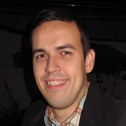

Fabio Mascarenhas
-----------------

Assistant Professor at [DCC/UFRJ](http://www.dcc.ufrj.br). Programming Languages and Compilers researcher,
in the areas of parsers, type systems and runtime environments for dynamic languages. Active member of
the [Lua programming language](http://www.lua.org) community sinze 2003 and author of several free
software libraries.

*"The programs we use to conjure processes are like a sorcerer's spells. They are carefully composed from symbolic expressions in arcane and esoteric programming languages that prescribe the tasks we want our processes to perform."* &mdash; Abelson, Sussman, and Sussman. [*Structure and interpretation of Computer Programs*](http://mitpress.mit.edu/sicp/).

### Social Networks

#### [Lattes](http://buscatextual.cnpq.br/buscatextual/visualizacv.do?id=K4755986D9) - curriculum vitae

#### [Github 1](https://github.com/mascarenhas)/[Github 2](https://github.com/fabiomascarenhas) - free software

#### [Facebook](https://www.facebook.com/mascarenhasufrj) - groups for courses at UFRJ

#### [Google Scholar](http://scholar.google.com/citations?user=kdEMTYkAAAAJ) - papers

#### [Google Plus](https://plus.google.com/106095493628335523079/about)

### External Courses

Send me an [email](mailto:mascarenhas@ufrj.br) if you would like to contract me for a short course at your school or company, in one of my specialties.

#### [Programming in Lua](lua) - Nankai University, Tianjin, China, July 2013

### Courses at UFRJ

#### 2013.2

##### [Compiladores I](comp) / [Computação I (Engenharia)](python)

#### 2013.1

##### [Compiladores I](comp20131) / [Linguagens de Programação](lp)

#### 2012.2

##### [Compiladores I](comp20122) / [Computação II (Computação)](java)

#### 2012.1

##### [Compiladores I](comp20121) / [Computação II (Computação)](java20121)

#### 2011.2

##### [Compiladores I](comp20112) / [Semântica de Linguagens de Programação](sem)

#### 2011.1

##### [Computação II (Engenharia)](mab225) / Compiladores II

* * * * *

Last update: {{ site.time | date: "%Y-%m-%d %H:%M" }}
