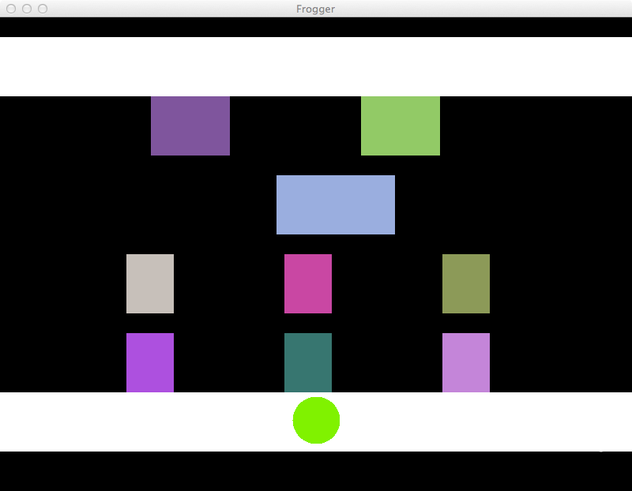

MAB 240 - Computação II
=======================

Laboratório 3 - 12/11/2012
--------------------------

Nesse laboratório vocês começarão a desenhar a interface do *Frogger*, e implementarão parte da
mecânica do jogo. Para isso, você utilizarão as classes `Motor`, `Tela` e `Cor` usadas no Space
Invaders, só que com uma classe `Jogo` que implementa Frogger.

Comecem baixando e abrindo no Eclipse o [esqueleto do Frogger](Frogger.zip). O Eclipse não tem
uma opção "Open Project..." no menu "File", portanto vocês têm que abrir a opção "Import..." do
menu "File", e na caixa de diálogo que aparece abrir a opção "General" clicando na seta ao lado
dela, depois clicar na opção "Existing Projects into Workspace" para selecioná-la e clicar no
botão "Next". Na tela seguinte, clique para selecionar a opção "Select archive file", depois
clique no botão "Browse..." dela e procure o arquivo "Frogger.zip" que você baixou. Finalmente,
clique no botão "Finish". O projeto "Frogger" deve aparecer na aba "Package Explorer" do Eclipse.

Nesse laboratório vocês implementarão a lógica necessária para exibição do tabuleiro do jogo
na tela, e do movimento dos carros. O movimento do sapo e a lógica do "atropelamento" ficará para
o próximo laboratório. O tabuleiro do jogo consiste de:

* Dois retângulos de 800 pixels por 75 pixels, marcando as duas "calçadas". Não precisam ser
  objetos, já que são elementos estacionários do jogo;
* Quatro faixas de carros; a primeira faixa tem 2 carros com 100 pixels de comprimento, e
  que atravessam a tela em 5 segundos, a segunda faixa tem 1 carro com 150 pixels de comprimento
  e que atravessa e tela em 2 segundos, a terceira faixa tem 3 carros com 60 pixels de comprimento
  e que atravessem a tela em 8 segundos, e a quarta faixa tem 4 carros com 60 pixels de
  comprimento e que atravessam a tela em 6 segundos. Todos os carros têm 75 pixels de altura, e
  cores aleatórias;
* O sapo, com 60 pixels de diâmetro, e cor verde, começa no centro da calçada de baixo;
* O contador de vidas do sapo, no canto inferior direito, com tamanho 40.

A distância entre uma faixa de carros e a outra é de 100 pixels. A figura abaixo mostra
uma possível disposição inicial de todos os elementos do jogo.

O movimento dos carros deve usar o método `mover` que vocês implementaram no [laboratório 2](lab2.html).
O movimento do sapo será implementado no próximo laboratório.

Enviando
--------

Use o formulário abaixo para enviar o Laboratório 3. O prazo para envio é sexta-feira, dia 23/11/2012.

* * * * *

Última Atualização: {{ site.time | date: "%Y-%m-%d %H:%M" }}
