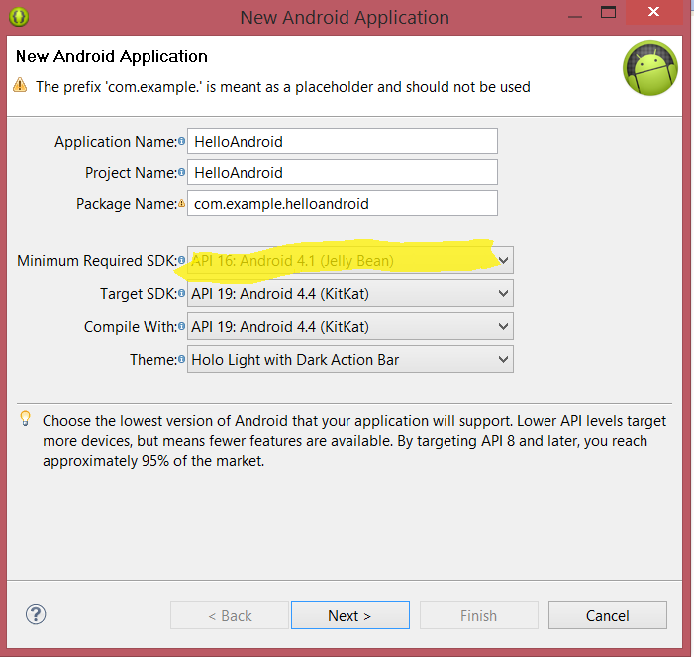
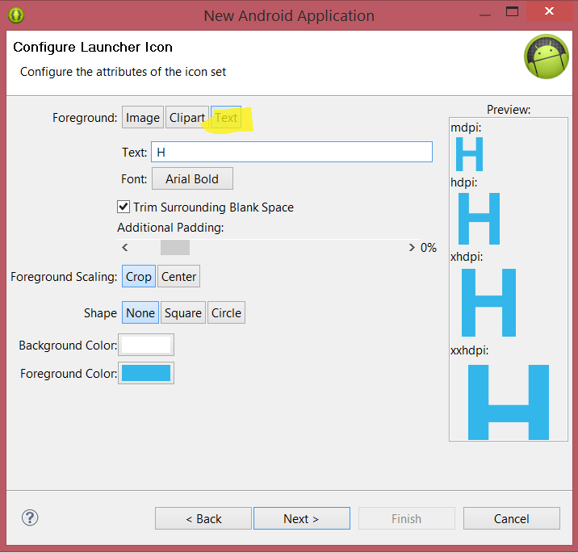
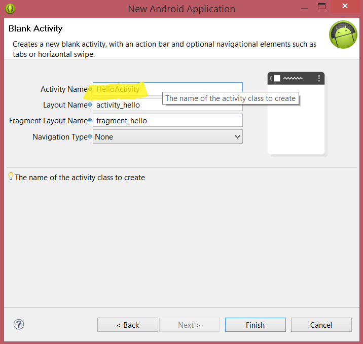
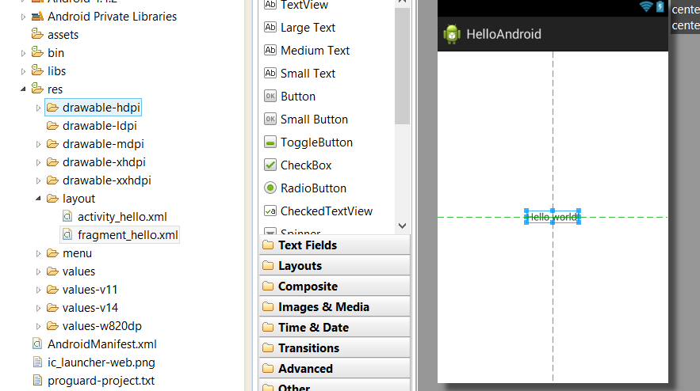
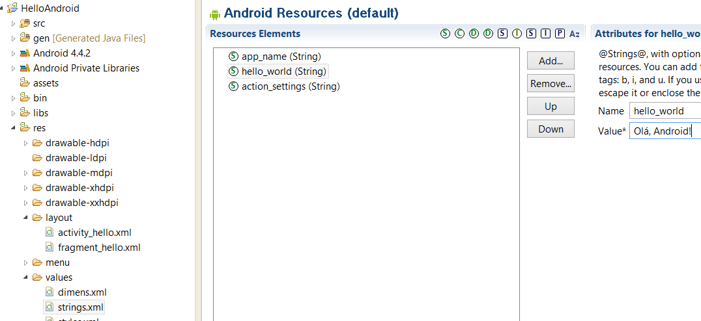

MAB 240 - Computação II
=======================

Laboratório 8 - 16/04/2014
--------------------------

No laboratório de hoje vamos instalar e executar o ambiente de desenvolvimento
Android, e criar uma aplicação simples.

1\. Nas máquinas do laboratório nós vamos instalar o ambiente ADT (Android Development Tools)
a partir de um pen drive. Em casa, você pode baixá-lo [desse link](http://developer.android.com/sdk/index.html),
clicando em "Download the SDK" e seguindo as instruções. O ADT é distribuído como um arquivo
zip, descompacte o seu conteúdo onde for mais conveniente.

2\. Agora que temos o ADT instalado, vamos rodá-lo indo na pasta `eclipse` dentro da
pasta do ADT, e dando um duplo clique na aplicação `eclipse` (o ícone é uma esfera).
A inicialização demora algum tempo. Como workspace, escolha alguma pasta dentro da sua
pasta de documentos.

3\. Uma vez que a tela principal do Eclipse apareça, vamos nos certificar de que temos
o emulador preparado para rodar aplicações. Vá no menu *Window*, e escolha a opção
*Android SDK Manager* dentro dele. O Eclipse abrirá uma janela como a janela abaixo.
Veja se a opção "Intel x86 Atom System Image" está com status "Installed". Se não
estiver, clique na checkbox ao lado dela, e depois no botão "Install 1 package...".
Depois disso feche o Eclipse e o abra novamente.

4\. Agora vá de novo ao menu *Window* e escolha *Android Virtual Device Manager*. Na janela
que irá aparecer, caso a tabela "List of existing..." esteja vazia, clique no botão "New..."
e preencha a janela que vai aparecer como está na figura abaixo. Clique em "Ok", depois feche
a janela do "Android Virtual Device Manager".

5\. Agora estamos prontos para criar uma aplicação. Vá no menu *File*, escolha *New*, depois
*Android Application Project*. Isso abrirá um *wizard* com cinco partes. A primeira é a
janela abaixo; chame a aplicação e o projeto de "HelloAndroid", e escolha "API 16" como
"Minimum Required SDK". Depois clique em "Next".

6\. A segunda parte do wizard é a janela abaixo. Não precisamos mudar nada, apenas clique em "Next".

7\. Na terceira parte, vamos mudar o ícone da aplicação do padrão para a letra H. Escolha
"Text", depois entre "H" na caixa de texto. Clique em "Next".

8\. Na quarta parte escolhemos o tipo de atividade que a aplicação vai ter por padrão.
Deixe como está, e clique em "Next".

9\. Na quinta e última parte, vamos mudar o nome da atividade para "HelloActivity". Clique
em "Finish".

10\. O projeto "HelloAndroid" agora deve aparecer no "Package Explorer". Antes de rodá-lo,
vamos fazer duas alterações, mostradas nas imagens abaixo. Na primeira delas, vamos no
layout "fragment_hello.xml" mudar a posição do label do canto superior esquerdo da
tela para o centro. Faça isso clicando no label e arrastando. Salve o arquivo.

11\. Na segunda mudança, vamos em "strings.xml", mudar o valor de `hello_world` para
uma string à sua escolha. Salve o arquivo.

12\. Por último, vamos rodar nosso programa no emulador. Selecione a raiz do projeto
no "Project Manager", depois vá no menu *Run*, opção *Run As*, e escolha *Android Application*.
Aguarde um pouco, e a janela do emulador deve aparecer. Depois que o emulador terminar de
carregar, ele pode ficar na lock screen; para ver a aplicação, destrave o emulador arrastando
o cadeado para a direita.

* * * * *

Última Atualização: {{ site.time | date: "%Y-%m-%d %H:%M" }}

