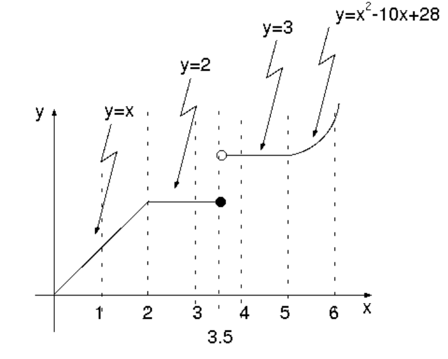

## Laboratório 2

1\. João quer comprar o maior número de bombons possível com o dinheiro que tem. Faça funções para:

    I. calcular o número de bombons e o troco, dados o dinheiro e o preço do bombom.
    II. calcular quanto Joãozinho terá que pedir para sua mãe para comprar um bombom a mais, usando a função anterior.

2\. Faça uma função que calcule a hipotenusa de um triângulo retângulo dados os seus catetos (use `math.sqrt`),
depois faça outra função que usa a primeira para calcular o perímetro do triângulo, dados seus catetos.

3\. Faça uma função que calcule a distância entre dois pontos, dadas as suas coordenadas, usando a função
`hipotenusa` da questão 2.

4\. Faça uma função que calcule a soma do quadrado do seno com o quadrado do cosseno de um ângulo dado (use as
funções `math.sin` e `math.cos`).

5\. Calcule a distância que um barco percorreu ao atravessar um rio dadas a largura do rio, a velocidade do
barco perpendicular à correnteza e a velocidade da correnteza. Use na resposta duas funções que você já tem
(lembre-se das funções do [laboratório 1](lab1.html)).

6\. Faça uma função para calcular a(s) raízes reais de uma equação de segundo grau, dados seus coeficientes. A
função deve retornar o número de raízes que a equação tem (0, 1 ou 2) seguido da(s) raíze(s), se existirem.

7\. A distância que uma bala de canhão percorre é função do tempo de vôo e do componente horizontal de
sua velocidade. Faça funções para:

    I. calcular a distância percorrida pela bala do canhão dado o ângulo de tiro e a velocidade da bala
    II. calcular as coordenadas em um plano onde a bala cai dada direção (o ângulo em relação ao eixo x), o ângulo de tiro e a velocidade da bala, dado que o canhão está na origem do plano, usando a função anterior.

8\. Calcule a soma de uma progressão aritmética dados o valor inicial, o valor final e a razão. Decomponha
o problema em três funções, uma para calcular o número de termos dados os valores inicial e final e a razão,
outra para calcular a soma dados os valores inicial e final e o número de termos, e a função pedida.

9\. Defina a função matemática a seguir. Qual o número mínimo de casos de teste para garantir que todas
as linhas do programa são executadas? Crie casos de teste para
os pontos de inflexão da função (as fronteiras entre cada parte).

10\. Faça uma função que receba três valores e os retorne em ordem crescente. Faça uma função que receba três
valores e retorne o terceiro deles. Faça uma terceira função que compõe as duas anteriores para fazer
uma função que recebe três valores e retorna o maior deles.
