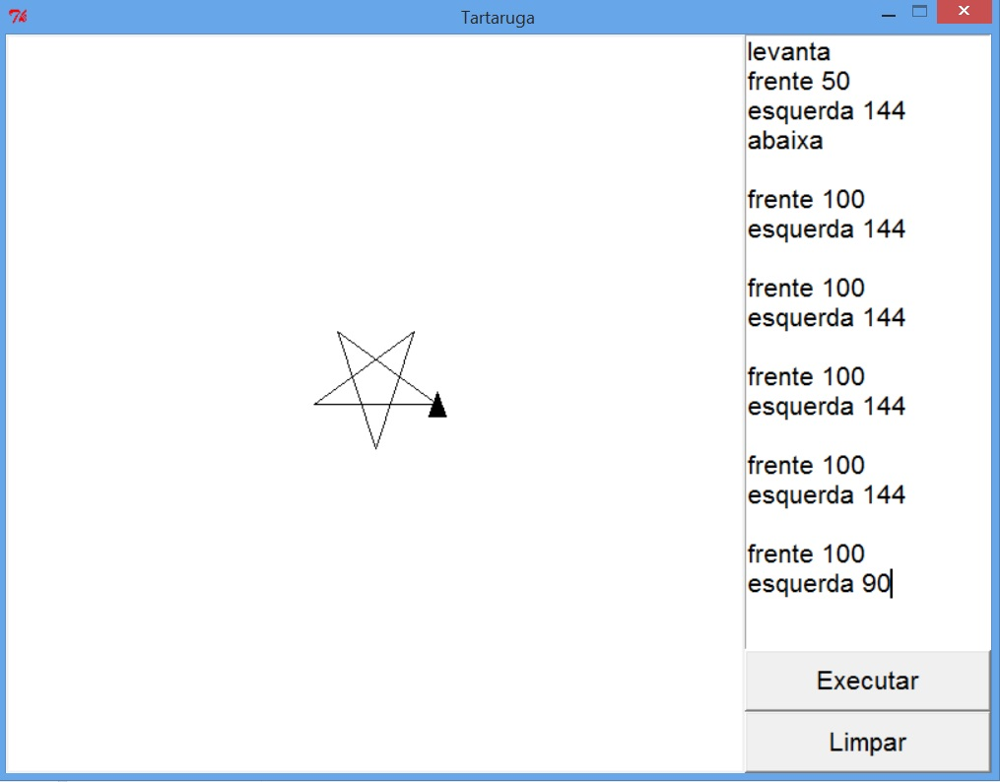

MAB 225 - Computação II
=======================

Laboratório 9 - 10/06/2015
--------------------------

Nesse laboratório vocês irão construir uma interface gráfica para um programa de
desenho usando uma ["tartaruga"](http://pt.wikipedia.org/wiki/Gr%C3%A1ficos_tartaruga) como
na captura de tela abaixo. A tartaruga (representada por um triângulo) responde a comandos
para andar para a frente e para trás um determinado número de pixels e para virar à esquerda
e à direita determinado ângulo em graus. Normalmente quando ela anda ela deixa um rastro,
mas ela pode ser comandada para levantar sua "caneta" e não deixar rastro nenhum, ou
abaixar a "caneta" e voltar a deixar um rastro quando anda.

[Esse arquivo](lab9.py) tem o modelo da tartaruga, e classes para os controles do Tkinter
que vocês irão precisar. O modelo (a classe `Tartaruga`) tem métodos que correspondem aos
comandos da tartaruga (`frente`, `tras`, `esquerda`, `direita`, `levanta`, `abaixa`),
assim como um método para voltar a tartaruga ao seu estado inicial (`reset`), e um
método para conectar observadores de mudanças no estado da tartaruga (`observa`).

A interface gráfica possui um grande canvas onde a tartaruga se desenha, uma caixa
de texto (use uma instância da classe `CaixaTexto` fornecida) onde comandos são entrados,
e dois botões, um para executar os comandos na caixa de texto, e outro para voltar
a tartaruga a seu estado inicial.

Os comandos são dados um em cada linha, sendo que podem haver linhas em branco. Os
comandos que movimentam a tartaruga possuem sempre um espaço entre o nome do comando
e seu argumento. Comandos errados devem ser ignorados.

As classes fornecidas não devem ser modificadas, o exercício deve ser todo feito definindo
novas classes que irão compor a interface gráfica da aplicação.

* * * * *

Última Atualização: {{ site.time | date: "%Y-%m-%d %H:%M" }}

